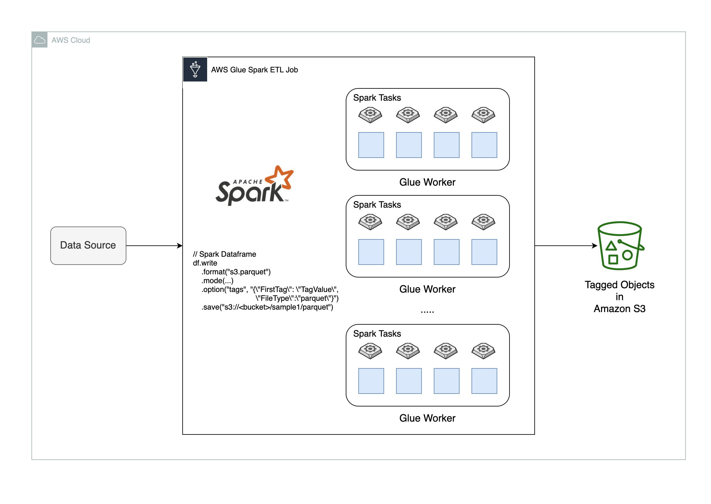

# Apache Spark based Amazon S3 object tagging 



This is a library built on top of Apache Spark for tagging Amazon S3 objects. This library helps you to tag objects at table level or partition level. This library supports the following file format options 

* CSV - `s3.csv`
* JSON - `s3.json` 
* Parquet - `s3.parquet`
* ORC - `s3.orc` 
* text - `s3.text` 
* Avro - `s3.avro` (Note:- using [spark-avro](https://mvnrepository.com/artifact/org.apache.spark/spark-avro_2.12/2.4.3))

## Requirements

* Java 8
* SBT 1.x.x+ (for building)
* Scala 2.11.x (for building)

## How to build the library ?

The project is compiled using [SBT](https://www.scala-sbt.org/1.x/docs/Command-Line-Reference.html). The library depends on Java 8 and is known to work with Apache Spark versions 2.4.3

* To compile the project, run `sbt compile`
* To generate the connector jar run `sbt assembly`

* The above commands will generate the following JAR:
```
target/scala-2.11/amazon-s3-tagging-spark-util-assembly-1.0.jar
```

This JAR includes the `spark-avro` and `commons-lang3` and its dependencies. They need to be put in Spark's extra classpath. 

## Configure AWS Glue ETL Job

Copy the JAR into Amazon S3 bucket
```shell
aws s3 cp target/scala-2.11/amazon-s3-tagging-spark-util-assembly-1.0.jar s3://$BUCKET/$PREFIX
```

Create a Glue ETL job with following special parameters. For more details on [AWS Glue Special Parameters](https://docs.aws.amazon.com/glue/latest/dg/aws-glue-programming-etl-glue-arguments.html).

```yaml
"--extra-jars" : "s3://$BUCKET/$PREFIX/amazon-s3-tagging-spark-util-assembly-1.0.jar"
```

Sample Scala Spark Code: For this example, we assume that we work on some kind of `customer` data, where every it has customer id, name , street, city and country.

```scala
case class Customer(id: Long, name: String, street: String, city: String, country: String)
```
Our library is built on Apache Spark and is designed to work with very large datasets that typically live in a distributed filesystem. For the sake of simplicity in this example, we just generate a few records though.

```scala
val rdd = spark.parallelize(Seq(
  Customer(1, "James Butt", "627 Walford Ave", "Dallas", "Dallas"),
  Customer(2, "Gearldine Gellinger", "4 Bloomfield Ave", "Irving", "Dallas"),
  Customer(3, "Ozell Shealy", "8 Industry Ln", "New York", "New York"),
  Customer(4, "Haydee Denooyer", "25346 New Rd", "New York", "New York"),
  Customer(5, "Mirta Mallett", "7 S San Marcos Rd", "New York", "New York")))

val customerDataFrame = spark.createDataFrame(rdd)
```

Store the data into S3 and tag the objects using additional options.

```scala
// Option 1: Static Tagging
customerDataFrame
  .write
  .format("s3.parquet")
  .option("tag", "{\"ProjectTeam\": \"Team-A\", \"FileType\":\"parquet\"}")
  .save("s3://$DATA_BUCKET/$TABLE_NAME")

// Option 2: Dynamic Tagging using partition value
customerDataFrame
  .write
  .partitionBy("country")
  .format("s3.parquet")
  .option("tag", "{\"ProjectTeam\": \"Team-A\", \"Country\":\"${country}\"}")
  .save("s3://$DATA_BUCKET/$TABLE_NAME")
```

## License

This library is licensed under the Apache 2.0 License.
